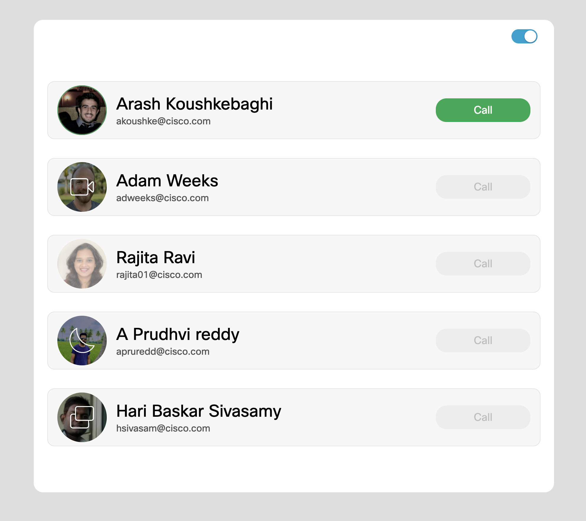

[![Contributors][contributors-shield]][contributors-url]
[![Forks][forks-shield]][forks-url]
[![Stargazers][stars-shield]][stars-url]
[![Issues][issues-shield]][issues-url]
[![MIT License][license-shield]][license-url]
[![LinkedIn][linkedin-shield]][linkedin-url]

<!-- PROJECT LOGO -->
<br />
<p align="center">
  <h2 align="center">Webex Presence</h2>

  <p align="center">
  subscribe to others presence statuses using Webex SDK internal plugin! 
    <br />
    <a href="https://github.com/WXSD-Sales/presence-on-device"><strong>Explore the docs »</strong></a>
    <br />
    <br />
    <a href="https://wxsd-sales.github.io/presence-on-device/">View Demo</a>
    ·
    <a href="https://github.com/WXSD-Sales/presence-on-device/issues">Report Bug</a>
    ·
    <a href="https://github.com/WXSD-Sales/presence-on-device/issues">Request Feature</a>
  </p>
</p>

<!-- TABLE OF CONTENTS -->
<details open="open">
  <summary>Table of Contents</summary>
  <ol>
    <li>
      <a href="#about-the-project">About The Project</a>
      <ul>
        <li><a href="#built-with">Built With</a></li>
      </ul>
    </li>
    <li>
      <a href="#getting-started">Getting Started</a>
      <ul>
        <li><a href="#installation">Installation</a></li>
      </ul>
    </li>
    <li><a href="#contributing">Contributing</a></li>
    <li><a href="#license">License</a></li>
    <li><a href="#contact">Contact</a></li>
  </ol>
</details>

<!-- ABOUT THE PROJECT -->

## About The Project

[](link)

In this demo we show how to subscribe to others and set self statuses using webex JS SDK.

### Built With

- [Webex Browser SDK](https://github.com/webex/webex-js-sdk)
- [React](https://reactjs.org)
- [TypeScript](https://www.typescriptlang.org/)

<!-- GETTING STARTED -->

## Getting Started

If you would like to contribute to our source code and to improve our demo, please follow the steps mentioned below:

### Installation

1. Clone the repo
   ```sh
   git clone https://github.com/WXSD-Sales/presence-on-device.git
   ```
2. We use NVM to manage our node.js machine versioning. You can learn more about NVM [here](https://github.com/nvm-sh/nvm)
   ```sh
   nvm use
   ```
3. Install the packages via [Yarn](https://classic.yarnpkg.com/en/)
   ```sh
   yarn
   ```
4. Start the server
   ```sh
   yarn start
   ```

<!-- CONTRIBUTING -->

## Contributing

Contributions are what make the open source community such an amazing place to be learn, inspire, and create. Any contributions you make are **greatly appreciated**.

1. Fork the Project
2. Create your Feature Branch in your forked repo (`git checkout -b myrepo/AmazingFeature`)
3. Commit your Changes (`git commit -m 'Add some AmazingFeature'`)
4. Push to the Branch (`git push origin myrepo/AmazingFeature`)
5. Open a Pull Request

<!-- LICENSE -->

## License

Distributed under the MIT License. See `LICENSE` for more information.

<!-- CONTACT -->

## Contact

wxsd@cisco.external.com

<!-- MARKDOWN LINKS & IMAGES -->
<!-- https://www.markdownguide.org/basic-syntax/#reference-style-links -->

[contributors-shield]: https://img.shields.io/github/contributors/WXSD-Sales/presence-on-device.svg?style=for-the-badge
[contributors-url]: https://github.com/WXSD-Sales/presence-on-device/graphs/contributors
[forks-shield]: https://img.shields.io/github/forks/WXSD-Sales/presence-on-device.svg?style=for-the-badge
[forks-url]: https://github.com/WXSD-Sales/presence-on-device/network/members
[stars-shield]: https://img.shields.io/github/stars/WXSD-Sales/presence-on-device.svg?style=for-the-badge
[stars-url]: https://github.com/WXSD-Sales/presence-on-device/stargazers
[issues-shield]: https://img.shields.io/github/issues/WXSD-Sales/presence-on-device.svg?style=for-the-badge
[issues-url]: https://github.com/WXSD-Sales/presence-on-device/issues
[license-shield]: https://img.shields.io/github/license/WXSD-Sales/presence-on-device.svg?style=for-the-badge
[license-url]: https://github.com/WXSD-Sales/presence-on-device/blob/master/LICENSE.txt
[linkedin-shield]: https://img.shields.io/badge/-LinkedIn-black.svg?style=for-the-badge&logo=linkedin&colorB=555
[linkedin-url]: https://www.linkedin.com/in/arash-koushkebaghi-9b1701a4/
[product-screenshot]: assets/images/presence.png